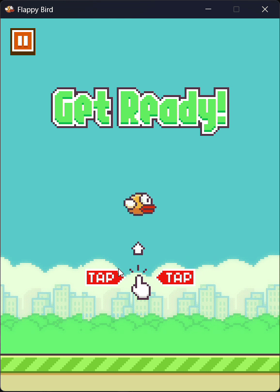

# Flappy Bird SDL3

A simple Flappy Bird clone written in C++ using the SDL3 library.  
This project was created as a first step in learning SDL3 basics.



---

## About

This is a small learning project focused on understanding how SDL3 works in practice.  
The code is intentionally kept simple and straightforward.

---

## Controls

- **Esc** — pause
- **Enter** — working like "OK" button
- **Any mouse buttons / Space** — jump

---

## Requirements

- C++17 compatible compiler
- CMake 3.8
- SDL3
- SDL3_image with PNG format support

---

## Build

Example building:

```bash
git clone https://github.com/Amibrc/Flappy-Bird-SDL3
cd Flappy-Bird-SDL3
cmake -B build
cmake --build build
```

## License

Distributed under the MIT License. See the [LICENSE](./LICENSE) file for details.